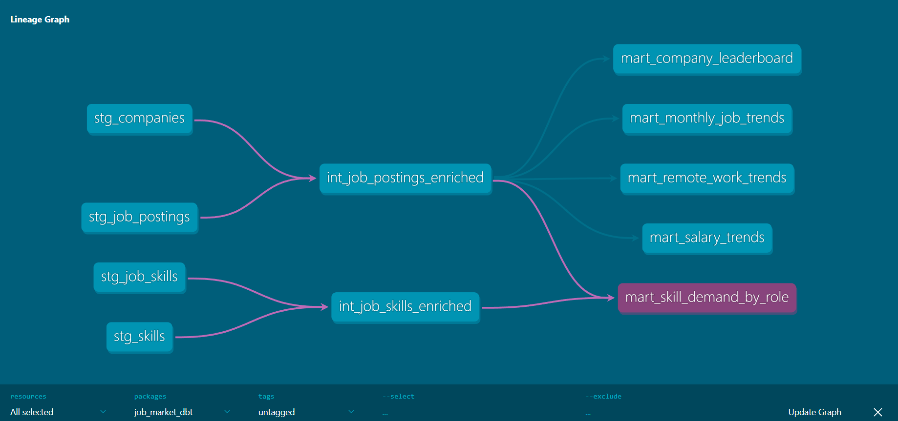
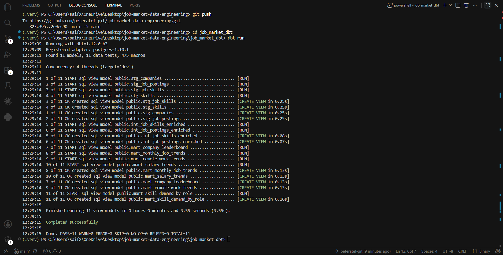
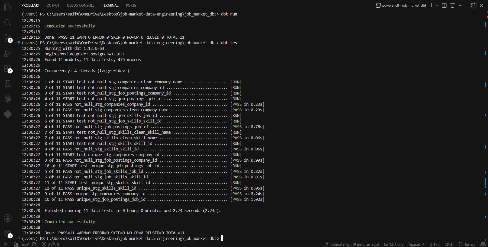

# Job Market Data Engineering Project

## Project Overview

This project analyzes job market data for data-related roles using SQL and a layered data engineering workflow.

The goal is to transform raw job posting data into clean, reliable, and business-ready analytics models that can be used to answer questions about job demand, skills, remote work trends, salary trends, and company hiring activity.

This project is structured like a real data engineering workflow, starting from raw tables, then building staging models, intermediate models, analytics marts, quality checks, and final business insights.

---

## Business Questions

This project answers questions such as:

* What are the most demanded skills for Data Engineer roles?
* Which companies have the highest hiring activity?
* How is the job market changing month over month?
* Are remote Data Engineer roles increasing or decreasing over time?
* How do salaries change across roles and remote statuses?
* Which companies have the highest share of remote job postings?

---

## Project Structure

```text
job_market_dbt/
├── models/
│   ├── staging/
│   ├── intermediate/
│   └── marts/
├── tests/
├── macros/
├── analyses/
├── snapshots/
└── dbt_project.yml
```

---

## Data Flow

Raw Tables
↓
Staging Models
↓
Intermediate Models
↓
Analytics Marts
↓
Business Insights

---
### Folder Description

* `staging/`: Cleans and standardizes raw source tables.
* `intermediate/`: Joins cleaned staging models into reusable enriched datasets.
* `marts/`: Contains business-ready analytics models.
* `quality_checks/`: Validates row counts, nulls, duplicates, orphan keys, and calculation logic.
* `insights/`: Stores SQL queries used to generate README insights.
* `sql_training/`: Contains SQL practice and learning queries.

---

## SQL Architecture

The SQL workflow is organized into three main layers:

### 1. Staging Layer

The staging layer cleans and standardizes raw source tables while preserving the original row-level structure.

Models:

* `stg_job_postings`
* `stg_companies`
* `stg_skills`
* `stg_job_skills`

Examples of transformations in this layer:

* Standardizing text values using `LOWER()` and `TRIM()`
* Handling null and blank values using `COALESCE()` and `NULLIF()`
* Creating cleaned fields such as `clean_job_title`, `clean_job_location`, and `clean_company_name`
* Creating business-friendly classifications such as `remote_status` and `salary_category`
* Creating `posted_month` using `DATE_TRUNC()`

---

### 2. Intermediate Layer

The intermediate layer joins cleaned staging models and prepares reusable enriched datasets.

Models:

* `int_job_postings_enriched`
* `int_job_skills_enriched`

Examples:

* `int_job_postings_enriched` combines job postings with cleaned company names.
* `int_job_skills_enriched` combines job-skill relationships with cleaned skill names and skill types.

These models reduce repeated joins and create reliable building blocks for analytics marts.

---

### 3. Mart Layer

The mart layer contains business-ready analytics models used to generate insights.

Models:

* `mart_skill_demand_by_role`
* `mart_remote_work_trends`
* `mart_salary_trends`
* `mart_company_leaderboard`
* `mart_monthly_job_trends`

Each mart is designed around a specific business question.

---

## Analytics Marts

### `mart_skill_demand_by_role`

Analyzes the most demanded skills for each job role.

Main metrics:

* `job_title_short`
* `clean_skill_name`
* `clean_skill_type`
* `demand_count`

---

### `mart_remote_work_trends`

Analyzes remote, onsite, and unknown job status trends by month and role.

Main metrics:

* `posted_month`
* `job_title_short`
* `remote_status`
* `total_jobs`
* `monthly_role_total`
* `remote_status_percentage`

---

### `mart_salary_trends`

Analyzes salary trends by month, role, and remote status.

Main metrics:

* `posted_month`
* `job_title_short`
* `remote_status`
* `total_salary_jobs`
* `avg_salary`
* `min_salary`
* `max_salary`
* `previous_month_avg_salary`
* `salary_difference`
* `salary_growth_percentage`

---

### `mart_company_leaderboard`

Ranks companies by hiring activity and remote job share.

Main metrics:

* `company_id`
* `clean_company_name`
* `total_jobs`
* `remote_jobs`
* `onsite_jobs`
* `known_salary_jobs`
* `avg_salary`
* `remote_percentage`

---

### `mart_monthly_job_trends`

Analyzes month-over-month job market changes.

Main metrics:

* `posted_month`
* `total_jobs`
* `previous_month_jobs`
* `job_difference`
* `job_growth_percentage`

---

## Data Quality Checks

Quality checks were created to validate the reliability of the SQL models.

The checks include:

* Row count comparisons between staging, intermediate, and mart models
* Missing values in key columns
* Duplicate job IDs
* Duplicate job-skill relationships
* Orphan keys between job postings, companies, and skills
* Null checks after joins
* Percentage calculation checks
* Month-over-month growth calculation checks
* Grain validation, such as one row per month in monthly trend marts

Examples of data quality checks:

* Ensuring staging row counts match raw source row counts
* Ensuring `job_id` does not contain duplicates
* Ensuring every `skill_id` in the job-skill bridge exists in the skills table
* Ensuring every `job_id` in the job-skill bridge exists in the job postings table
* Ensuring mart percentage calculations are logically valid

---

## Key Insights

### 1. Data Engineer Skills Demand

SQL and Python are the most demanded skills for Data Engineer roles, appearing in 233,132 and 224,102 job postings respectively.

Cloud platforms such as AWS and Azure are also highly demanded, followed by big data tools including Spark, Databricks, Snowflake, Scala, and Kafka.

This suggests that Data Engineer roles require a strong combination of SQL, Python, cloud platforms, and distributed data processing tools.

Top Data Engineer skills:

```text
1. SQL         233,132 job postings
2. Python      224,102 job postings
3. AWS         130,205 job postings
4. Azure       128,822 job postings
5. Spark       106,904 job postings
6. Java         69,657 job postings
7. Databricks   63,012 job postings
8. Snowflake    60,379 job postings
9. Scala        57,079 job postings
10. Kafka       56,410 job postings
```

---

### 2. Top Hiring Companies

The company leaderboard shows that `bebee careers` has the highest number of job postings with 32,224 listings, followed by `emprego`, `dice`, `capital one`, `amazon`, and `listopro`.

However, some of the top entities appear to be job boards or aggregators rather than direct hiring companies. This is an important dataset limitation when interpreting company-level hiring activity.

Examples:

```text
bebee careers       32,224 job postings
emprego              6,669 job postings
dice                 6,568 job postings
capital one          6,332 job postings
amazon               6,204 job postings
listopro             5,109 job postings
```

Some platforms also show a high remote job percentage, such as:

```text
upwork      90.62% remote
listopro    87.00% remote
dice        52.83% remote
```

This should be interpreted carefully because some of these entities may represent job boards or platforms rather than direct employers.

---

### 3. Monthly Job Market Growth

The monthly job market showed strong volatility across the dataset period.

Job postings dropped sharply from January to February 2023 by 29.82%, followed by several recovery months such as June 2023 (+18.26%) and August 2023 (+18.00%).

The largest declines appeared around September and October 2024, with job postings falling by more than 36% month over month. December 2024 and January 2025 showed a major rebound, growing by 147.60% and 98.29% respectively.

This suggests that job posting activity may be affected by seasonality, market changes, or source collection patterns.

---

### 4. Remote Work Trend for Data Engineer Roles

Data Engineer postings were mostly onsite across the dataset.

In 2023, remote Data Engineer roles generally represented around 9% to 15% of monthly postings, reaching 15.00% in October 2023.

In 2025, the remote share declined significantly, with remote postings dropping to around 3%–5% of monthly Data Engineer postings.

Examples:

```text
February 2025: 3.39% remote
June 2025:     4.24% remote
```

This indicates that Data Engineer roles in this dataset became more onsite-heavy over time, although this may also reflect changes in data source coverage or job posting classification.

---

## Limitations

* Salary data is missing for a large portion of job postings, so salary analysis only reflects postings with available salary values.
* Some company names appear to represent job boards, platforms, or aggregators rather than direct hiring companies.
* Remote status is derived from job location values and may not fully capture hybrid roles.
* Large month-over-month changes may reflect source collection patterns, seasonality, or changes in data coverage.
* The analysis is based on the available dataset and may not represent the entire global job market.

---

## Tools Used

* SQL
* PostgreSQL
* dbt
* DuckDB / MotherDuck
* VS Code
* Git & GitHub

---

## Skills Demonstrated

This project demonstrates:

* SQL data cleaning
* Data quality validation
* CTEs
* Window functions
* Aggregations
* Joins
* Staging models
* Intermediate models
* Analytics marts
* Data modeling
* dbt model development
* dbt testing
* Data lineage
* Data documentation
* Business insight generation
* Git-based project organization

---

## dbt Implementation

The project was migrated into dbt and organized using a layered architecture:

* Staging Layer
* Intermediate Layer
* Mart Layer

dbt was used for:

* Model dependency management using ref()
* Data quality testing
* Documentation generation
* Data lineage visualization

Implemented Tests:

* not_null
* unique

All dbt models and tests executed successfully.

---

## Project Screenshots

### dbt Lineage Graph



### dbt Run Results



### dbt Test Results



---

## Next Steps

Future improvements include:

* Building a Python ETL pipeline
* Extracting data from public APIs
* Loading raw data into PostgreSQL
* Building incremental dbt models
* Scheduling workflows with Airflow
* Containerizing the pipeline using Docker
* Creating Power BI dashboards
* Deploying the pipeline to a cloud environment
